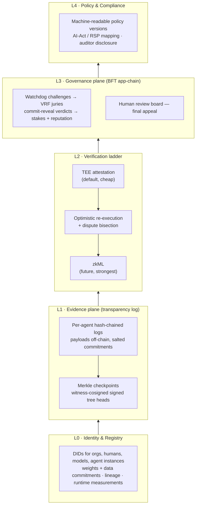
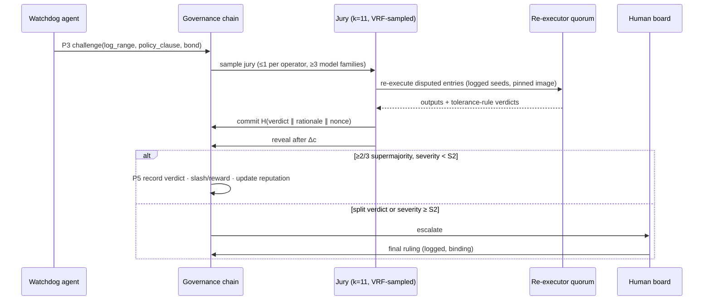

# PACT — Peer Accountability & Conduct Tracking

**A federated accountability ledger for AI systems.**
Architecture draft v0.1 — Saish Shinde, 2026-09-12. Working doc for the research paper and the open-source build. Name is a placeholder (§12).

---

## 0. The pitch

AI oversight is growing an institutional layer fast — third-party evaluations, safety commitments, the EU AI Act's record-keeping duties, public calls from major labs for evaluator access and internationally verifiable commitments. What's missing under all of it is a technical substrate. Verification today means trusting the operator's own logs — and the operator is exactly the party a verifier can't trust, because the operator can edit them.

I propose **PACT**: a federated ledger on which AI developers, deployers, independent auditors, and autonomous watchdog agents jointly maintain a tamper-evident record of *what a model is, what it did, and what happened when its conduct was challenged*. The protocol lets AI systems police each other: any registered watchdog agent can challenge a logged action; a randomly sampled, operator-diverse jury of evaluator models adjudicates; verdicts mechanically bind consequences (stake slashing, reputation, deployment gates). Humans sit above the loop as the mandatory court of final appeal.

Raw data never touches the chain — only cryptographic commitments — so the design stays private, cheap, and GDPR-survivable. Verification strength climbs a cost ladder: TEE attestation → optimistic re-execution with dispute games → zkML when it matures.

The property I want the paper to lead with: **the system is self-referential**. Every juror and watchdog is itself a registered, covered model whose verdicts are logged and challengeable by the same mechanism. Oversight of AI by AI, applied recursively, with a human backstop at the top.

---

## 1. Why a ledger at all (the honest version)

Rule I hold myself to, and will state in the paper: a shared ledger is justified only when (a) multiple parties must rely on one record, (b) those parties mutually distrust each other, and (c) no neutral single operator exists. AI oversight is precisely that case:

- **The log host may be the wrongdoer.** Self-hosted audit logs are editable by the audited. Any single-operator design reduces to "trust that operator."
- **No neutral party exists.** Labs won't accept a competitor hosting the record of their models' conduct; governments pursuing AI won't accept each other's databases; auditors need non-repudiation against everyone.
- **Detection isn't enough.** Certificate Transparency solved the analogous problem for TLS certificates, and it is the intellectual ancestor of this design — but CT is detection-only. AI oversight also needs *adjudication and consequences*, which is stateful protocol logic a passive log cannot hold. That delta is the reason the governance layer is a chain and not just a log.

Anti-hype commitments, stated up front so reviewers don't have to ask:

- **Permissioned BFT consortium chain.** No proof-of-work, no public token, no speculation. Validators are consortium members: labs, audit firms, academic nodes, eventually regulators. Incentives are bonds and reputation, not currency.
- **Chain load is independent of inference QPS.** Per-request data stays off-chain; the chain sees periodic Merkle checkpoints. A million inferences and a thousand inferences cost the ledger the same.
- **Two-plane design, minimal chain.** Evidence plane = a transparency log with multi-witness cosigning (Sigstore/Rekor-shaped — boring on purpose). Governance plane = a small BFT app-chain holding only registry, stakes, challenges, verdicts. Everything that *can* be a plain log *is* a plain log.

---

## 2. Threat model

**Principals.** Model developer *D*, deployer/operator *P*, auditor *A*, watchdog agent *W*, juror model *J*, governance validator *V*, log witness *T*, human review board *H*.

**Adversaries and their moves.**

| Adversary | Attack |
|---|---|
| Cheating operator *P* | Serve unregistered weights; omit actions from the log; tamper with logged entries; equivocate (show different logs to different parties) |
| Malicious watchdog *W* | Spam frivolous challenges; harass a competitor's models |
| Colluding jury subset | Coordinate verdicts to acquit an ally or convict a rival |
| Censoring validators | Refuse to include challenges against a member |
| Curious observer | Recover private prompt/output content from on-chain commitments |

**Trust assumptions.** At most *f* Byzantine among 3*f*+1 governance validators; at least one honest witness among log cosigners; TEE attestation trusted to hardware-vendor level (an explicit trust anchor, not magic); re-execution nondeterminism assumed bounded but not yet empirically measured (E3) — rung 2 (optimistic re-execution) is specified and unimplemented, so the tolerance is unquantified (see PAPER.md §VIII).

**Non-goals — said loudly (§9 expands).** PACT cannot force coverage: a model served outside an instrumented runtime logs nothing. It cannot prove absence of misbehavior, only make covered behavior non-repudiable and challengeable. It does not verify training-run claims (compute accounting is the complementary research line).

---

## 3. Accountability properties

Define a **covered action**: an inference or tool call served through a PACT-instrumented runtime. For every covered action, PACT provides:

1. **Attribution** — the action binds to (model version, weights commitment, runtime measurement, operator identity).
2. **Integrity** — per-agent hash-chained log; any tamper breaks the chain against cosigned checkpoints.
3. **Non-repudiation** — entries signed by a key generated inside an attested runtime.
4. **Challengeability** — any registered watchdog may open a challenge within window Δ, citing specific entries and a specific policy clause.
5. **Adjudicability** — every challenge terminates in a recorded verdict with a rationale commitment.
6. **Consequence binding** — verdicts mechanically update stake, reputation, and registry status; deployment gates read status.

The paper should state these semi-formally and argue: integrity holds under the BFT assumption; equivocation is detected by witness gossip (CT-style); jury soundness degrades gracefully with collusion fraction (simulated in E5).

---

## 4. Architecture



### L0 — Identity & registry

W3C DIDs for every principal: organizations, human board members, model versions, running agent instances. A registry entry per model version holds:

```
{ weights_root,            // Merkle root over weight shards
  data_manifest_root,      // commitment to training-data manifest (sealed OK)
  lineage,                 // fine-tuned-from → parent registry entry
  model_card_hash,
  policy_hash,             // the policy this model claims to serve under
  runtime_measurements[]   // approved TEE image measurements
}
```

Agent-instance signing keys are generated inside attested enclaves, so one signature transitively binds *output → runtime image → registered weights → operator*.

### L1 — Evidence plane

Each agent instance maintains a hash-chained log. Entry schema (sketch):

```json
{
  "seq": 48211,
  "prev": "b3:9f2c…",
  "ts": "2026-09-12T10:44:03Z",
  "model": "did:pact:acme/helper-70b@v3.2",
  "runtime": { "tee_quote": "…", "image": "sha256:…" },
  "input_commit":  "b3:H(salt_i || prompt)",
  "output_commit": "b3:H(salt_o || output)",
  "tool_calls": [ { "name": "send_email", "args_commit": "b3:…" } ],
  "policy": "pol:v7#c14",
  "sample": { "seed": 1189, "temp": 0.7, "top_p": 0.9 },
  "sig": "ed25519:…"
}
```

- **Privacy.** Prompts/outputs are committed with per-entry salts (held by the operator, escrow-shared with auditors under their remit). Salting kills dictionary attacks on hashed PII; deleting payload + salt makes the on-ledger commitment permanently unlinkable — the GDPR-erasure story.
- **Checkpointing.** Every *T* seconds or *N* entries, the log's Merkle root goes to the transparency log; independent witnesses cosign the signed tree head; the governance chain records it. CT-style inclusion and consistency proofs make omission-after-the-fact and history rewrites detectable.
- **Provenance out the front door.** Outputs can carry a C2PA-style manifest referencing their log entry, so downstream consumers can trace any artifact back to model + entry.

### L2 — Verification ladder

Three rungs, cost-ordered; a challenge climbs only as high as it needs:

1. **Attestation (default).** TEE quotes per checkpoint bind the log to registered weights and an approved runtime image (NVIDIA confidential computing, Intel TDX). Catches wrong-model-served and tampered-runtime. Trust anchor: hardware vendor — named as such.
2. **Optimistic re-execution (on challenge).** Sampling seeds and parameters are logged, so a challenged inference is re-runnable. A fraud-proof-style bisection narrows a disputed log range to single entries; a quorum of independent re-executors re-runs them on pinned images. **Nondeterminism honesty:** bitwise GPU reproducibility across heterogeneous hardware is not achievable; the dispute rule accepts within a logit tolerance ε (or token-level agreement), and the re-executor quorum decides by majority. Disagreement rates remain unmeasured (E3) — rung 2 is specified but unimplemented (see PAPER.md §VIII).
3. **zkML (roadmap, not dependency).** ZK proofs of inference are feasible today only for small models. Slot in first for small, high-stakes judge models. The architecture treats this rung as pluggable.

### L3 — Governance plane ("AI governing AI")

- **Watchdogs.** Anyone can register one. A watchdog subscribes to the checkpoint stream plus whatever disclosure its remit grants (public metadata for all; sampled payloads for auditors). It files a challenge: `{log_range, policy_clause, evidence_commits, bond}`.
- **Juries.** A VRF (seeded by block hash + challenge id) samples a committee of *k* = 11 from registered evaluator models, under **diversity constraints: at most 1 juror per operator, at least 3 distinct base-model families.** That bounds both collusion and correlated model failure. Voting is **commit-reveal** — commit `H(verdict ‖ rationale_hash ‖ nonce)`, reveal after the commit window — which kills copy-voting. Supermajority ≥ 2/3 decides.
- **Human backstop.** Split verdicts, or any case at severity ≥ S2, escalate to the human review board, whose ruling is final and itself logged. The framing that matters for the paper: AI-assisted, human-final governance — scalable oversight without ceding final authority.
- **Consequences.** Severity ladder S0 (advisory) → S1 (fine/slash) → S2 (probation) → S3 (registry suspension). Slashing rules: operator stake on proven violation; challenger bond on frivolous challenge (spam control); juror stake only for **provable process faults** — non-reveal and equivocation (committing one verdict, revealing another) — never for abstention or for voting with the minority: abstention is a protected, first-class verdict, not a fault (see PAPER.md §III-D), and punishing dissent breeds herding.
- **Reputation.** A time-decayed score per model and per operator, derived from verdict history — a public conduct record. **Teeth come from gates, not the chain:** deployment gateways, model marketplaces, procurement rules, and insurers check registry status before serving or buying. Exactly how CT only started mattering once browsers enforced it.
- **Recursion.** Jurors and watchdogs are covered models. Their verdicts are covered actions — challengeable by the same protocol. Who watches the watchmen: the same ledger.

### L4 — Policy & compliance

Policies are machine-readable, versioned, clause-addressable (`pol:v7#c14`); text lives off-chain, hash on-chain. Each external obligation compiles to a triple *(what must be logged, who may challenge, severity)* — mappings for EU AI Act Art. 12 record-keeping and Art. 26 deployer duties, NIST AI RMF, and lab RSP-style frontier commitments. Auditor access: Merkle-sampled disclosure under agreement today; ZK statements over logs ("no entries of class X") are named as an open problem, not promised.

---

## 5. Protocols

P1 registration · P2 logging & checkpoint · P3 challenge · P4 adjudication · P5 consequence. The interesting path:



---

## 6. "Federated," in both senses

- **Federated governance (the core).** Consortium validators, operator-diverse juries, witness cosigning — no single root of trust anywhere in the stack.
- **Federated learning (an application).** The same evidence plane records per-round client update commitments in FL training, enabling post-hoc poisoning attribution and Proof-of-Learning spot checks on training claims.

Scope call I'm making for v1: the core paper is **conduct of deployed models**; FL accountability is one application section with at most one experiment. Otherwise the paper sprawls and reviewers say "two papers."

---

## 7. Reference implementation (open-source plan)

| Component | Choice | Why |
|---|---|---|
| Evidence plane | Rekor/Trillian-style transparency log + 3 independent witnesses | Boring, proven, cheap |
| Governance plane | CometBFT ABCI app (Go) — ~5 tx types: `register`, `checkpoint`, `challenge`, `verdict`, `stake_op` | Smallest thing that holds state + BFT |
| Serving shim | vLLM / OpenAI-proxy middleware emitting signed hash-chain entries | Instruments real traffic with no app changes |
| Attestation | Dev signing keys in M0 → NVIDIA CC / TDX in M2 | Don't block MVP on TEE plumbing |
| Jury harness | Runner calling ≥3 hosted model families, commit-reveal orchestration | Diversity constraint from day one |
| Explorer | Tiny read-only UI over chain + log | Demos and audits |

Milestones: **M0** single-node log + shim + manual challenge (weeks, not months) · **M1** jury protocol end-to-end on seeded violations · **M2** attestation + 3-org testnet (mine + two collaborator/university nodes — external nodes are what make the "federated" claim credible) · **M3** eval suite for the paper.

Repo layout (as built): a flat `m0/` for implementation and experiments, plus the prose documents and `figs/` — see `README.md`. The `/chain /log /shim /jury /explorer /eval /paper` split was the original plan and was not built.

---

## 8. Evaluation plan

- **E1 Overhead.** Added p50/p99 latency and throughput at 10/100/1k QPS vs vanilla vLLM. Target: <1% p50.
- **E2 Detection quality.** Seed policy violations into replayed traffic on a benign evaluation domain — repository secret handling, clause `pol:v2#c1` — and measure watchdog precision/recall and jury-verdict agreement against held-out labels. Realized as **E14** (`m0/e14.py`); the corpus is built blind, with detectors committed before any data item existed. See `SAFETY-AND-ETHICS.md`.
- **E3 Reproducibility.** Cross-GPU (A100 / H100 / consumer) re-execution agreement rates as a function of tolerance ε — the empirical justification for the dispute rule.
- **E4 Dispute cost.** Wall-clock and dollar cost per challenge at bisection depth *d*.
- **E5 Collusion.** Simulated colluding-juror fractions vs verdict integrity, diversity constraint on/off — the graph that defends the jury design.
- **E6 Footprint.** Chain bytes and log bytes per 1M covered actions.

Baselines: no log · central single-operator log · CT-style log without adjudication. That comparison line is what proves each architectural piece earns its place.

---

## 9. Limitations (state them before reviewers do)

1. **Coverage / oracle problem.** PACT makes covered systems accountable; it cannot conscript uncovered ones. Adoption path mirrors CT: gates + regulation (AI-Act logging duties) create the pull. This is the paper's most attackable point — own it in §1 and §Discussion, never bury it.
2. **Attestation trust anchor** is the hardware vendor. Named, not hidden.
3. **Nondeterminism tolerance ε is attackable at the margin** — a cheater can aim for the tolerance band. Quantify the band (E3), don't hand-wave it.
4. **Jury gaming / Goodharting** — adversarial inputs aimed at judges; diversity, recursion, and human appeal mitigate, not eliminate.
5. **Consortium capture.** Validator-set rotation + a public witness ecosystem outside the consortium.
6. **Privacy–auditability tension** is managed (salted commitments, scoped disclosure), not solved.
7. **Training-time claims are out of scope** — compute accounting is the complement, cite it, don't absorb it.

---

## 9.5 Security analysis — attack surface and hardening

A note on framing, because it matters for the paper: **no real system is "not hackable at all," and a paper that claims unconditional security gets rejected on that sentence.** What a serious security paper claims instead — and what PACT claims — is three things:

1. **Conditional guarantees.** Properties P1–P6 hold *under stated assumptions* (§2): ≤ f Byzantine validators, ≥ 1 honest witness, vendor-level attestation trust, bounded nondeterminism.
2. **Defense in depth.** No single mechanism is load-bearing; each verification rung backstops the one above it.
3. **Graceful, detectable degradation.** When an assumption breaks, the system degrades to a named weaker guarantee and the break leaves cryptographic evidence — it never fails silently.

That framing is stronger, not weaker, than "unhackable": it tells an auditor exactly what has to be true for the system to be trustworthy, and exactly what happens when something isn't.

### Attack surface → defense → residual risk

| # | Attack | Defense | Residual / degradation |
|---|---|---|---|
| A1 | Operator runtime key theft | Keys generated inside attested enclaves, never exported; short-lived instance certificates; on-chain revocation list; rotation on every runtime image update | Stolen key valid only until revocation/expiry; entries it signed are quarantined, not trusted |
| A2 | TEE compromise / side channels | Attestation is rung 1 of 3, never sole evidence; measurement revocation on vendor advisories; challenged entries fall through to re-execution | Attribution weakens to operator-claimed until re-attestation; output fraud still caught by rung 2 |
| A3 | Log equivocation (split view) | ≥ 3 independent witness cosignatures per checkpoint; auditor gossip protocol compares signed tree heads | Full witness collusion enables equivocation — but any single honest auditor pair detects it with proof |
| A4 | Entry replay / reorder / omission | `seq` + `prev`-hash chain; CT-style consistency proofs between checkpoints | Omission *before* first checkpoint is the coverage problem (§9.1), stated as a non-goal |
| A5 | VRF grinding to bias jury selection | VRF seeded from *finalized* block hash + challenge id; jury drawn only after challenge tx finality; BFT finality forbids re-rolls | Validator-set-scale collusion required — collapses into A9 |
| A6 | Sybil watchdogs / jurors | Registration gated by consortium onboarding + stake; diversity constraint caps per-operator jury influence at 1 seat | Sybils cost real identity + stake per instance; spam handled by A7 |
| A7 | Challenge-spam DoS | Challenge bonds slashed on frivolous verdicts; per-identity rate limits; bond price scales with open challenge count | Well-funded harassment still possible — rate limit caps the burn rate; bonds flow to the harassed party |
| A8 | Prompt injection against juror models | Evidence delivered as structured data, never as instructions; jurors from ≥ 3 model families; rationale commitments audited; adversarial red-team suite run against the jury harness in CI (extends E14) | Mitigated, not eliminated — stated openly; human appeal is the backstop |
| A9 | Validator collusion (> f) | Accountable-BFT design: conflicting signed blocks are cryptographic evidence → slashing + public proof; validator rotation; witnesses sit *outside* the validator set | Safety can break at > f, but never deniably — forensic evidence identifies the signers |
| A10 | Governance capture of the consortium | Supermajority thresholds for rule changes; term limits + rotation for the human board; public witness ecosystem anyone can join | Political risk, honestly labeled as such in the paper |
| A11 | Payload/salt store breach | Per-entry salts (blast radius = one entry); salts in HSM/escrow; payload store encrypted at rest; access to it logged as covered actions on PACT itself (recursion again) | Breached salts de-anonymize only their own entries |
| A12 | Supply chain of shim / runtime images | Pinned digests, Sigstore-signed artifacts, reproducible builds; registry stores approved measurements only | Standard supply-chain residual; same tooling the evidence plane is built from |
| A13 | App-chain implementation bugs | Deliberately tiny state machine (5 tx types, no general-purpose smart contracts); TLA+ model checking of the challenge/verdict machine; property-based tests; external audit + bug bounty before any mainnet | The strongest hardening here is the small attack surface itself |

### Assurance practices (paper §Security, implementation reality)

- **Minimal chain = minimal target.** Five transaction types, no user-deployable contracts. Most "blockchain hacks" are smart-contract bugs; PACT structurally has none.
- **Formal spec.** TLA+ model of the challenge → adjudicate → consequence state machine, model-checked for safety/liveness before implementation freezes.
- **Everything signed, everything pinned.** Reproducible builds, Sigstore signing, digest-pinned images — the infrastructure eats its own provenance cooking.
- **External audit + bug bounty** gate any real deployment; the paper says so.

### Graceful-degradation ladder (the paragraph reviewers reward)

Break any one mechanism and PACT degrades to a named, detectable, weaker state — never silent collapse: TEE broken → re-execution still catches output fraud; witnesses collude → equivocation possible but provable by any honest pair; > f validators collude → consensus safety breaks *with* forensic evidence naming the signers; juror family compromised → diversity quorum + human appeal hold the verdict path. Security claim of the paper in one sentence: **every violation of every assumption is either tolerated or evidenced — nothing fails silently.**

---

## 10. Related work map  *(verify every citation before submission — do not trust from memory)*

- **Transparency logs:** Certificate Transparency (Laurie et al., RFC 6962); Trillian; Sigstore/Rekor; witness cosigning.
- **Verifiable-claims agenda:** Brundage et al. 2020, "Toward Trustworthy AI Development: Mechanisms for Supporting Verifiable Claims" — the ancestor problem statement.
- **Training/compute verification:** Jia et al. 2021 (Proof-of-Learning, IEEE S&P); Shavit 2023 (compute accounting for training-rule verification).
- **zkML:** Kang et al. 2022 (trustless DNN inference w/ ZK); EZKL tooling.
- **TEEs:** Intel TDX; NVIDIA Hopper confidential computing.
- **Optimistic verification / dispute games:** Kalodner et al. 2018 (Arbitrum, USENIX Security) — fraud proofs, bisection.
- **BFT consensus:** Castro & Liskov 1999 (PBFT); Buchman 2016 (Tendermint); Yin et al. 2019 (HotStuff).
- **Oversight-by-AI:** Irving et al. 2018 (AI safety via debate); Bai et al. 2022 (Constitutional AI); Zheng et al. 2023 (LLM-as-judge).
- **Provenance & documentation:** Mitchell et al. 2019 (model cards); Gebru et al. (datasheets); C2PA.
- **Blockchain × FL:** Nguyen et al. 2021 (survey); BAFFLE (Ramanan & Nakayama 2020).
- **Policy:** EU AI Act (Reg. 2024/1689) Arts. 12/26; NIST AI RMF 1.0; frontier-safety commitment frameworks; recent public calls for third-party verification of lab commitments.

**Positioning sentence for the paper:** to my knowledge, the first system that closes the full loop — log → challenge → adjudicate → consequence — for deployed AI conduct, with the adjudicators themselves covered by the same accountability mechanism.

---

## 11. Paper outline & venue plan

1. Introduction — the verification gap; contributions list.
2. Threat model & accountability properties (§2–3).
3. Design (§4–5).
4. Implementation (§7).
5. Evaluation (§8).
6. Discussion & limitations (§9).
7. Related work (§10).

9–12 pages. **Contribution claims to defend:** (C1) the accountability property set + protocol; (C2) the verification cost ladder with a nondeterminism-tolerant dispute rule; (C3) recursive AI-jury governance with collusion analysis; (C4) open-source reference implementation with overhead + detection numbers.

**Venue ladder:** arXiv preprint as soon as M1 results exist → IEEE SaTML or FAccT/AIES (governance framing) → USENIX Security / CCS if the systems results come out strong → a NeurIPS/ICLR workshop (regulatable ML) early for feedback. Pure ML venues are the wrong first target; this is a security/accountability-systems paper.

---

## 12. Naming

PACT = Peer Accountability & Conduct Tracking (working title). Alternatives: Covenant, Concord, Ledgered. Avoid Panoptic (surveillance vibe) and Overwatch (trademark). Check name collisions before going public.

## 13. Next steps

1. Freeze scope: deployed-model conduct core, FL as application.
2. Build M0: transparency log + vLLM shim + manual challenge path.
3. Verify every §10 citation against the actual papers.
4. Draft Introduction + Threat Model straight off this doc.
5. Recruit two external node operators for the M2 testnet — external nodes are the credibility of the federated claim.
